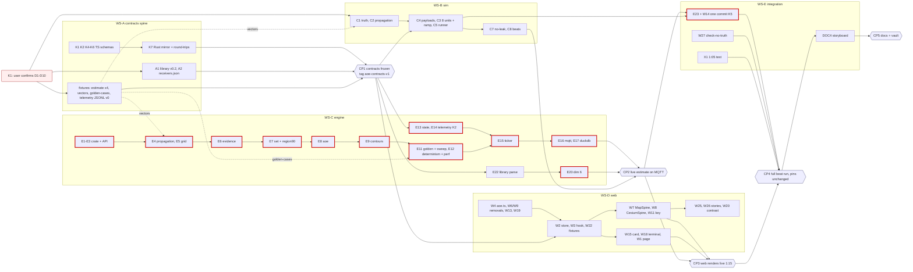

# Jammer AoE MVP: work breakdown and parallelisation plan

**Status:** plan only. No code is changed by this document.
**Branch:** `feat/aoe-preview` (draft PR #6, base `review/combined`), written at `e919692`.
**Scope:** the **reduced, cleared MVP** in `docs/plans/jammer-aoe.md` (§0 review record, §2 rows, §4 sequencing, §5 tests, §7.2 decisions). Every unit of work below is a §2 row ID (C*, K*, E*, A*, W*, X1, DOC4). The one exception is the fixture spine (§3), which is carved out of the plan's 0.5 d integration budget. Nothing deferred or cut in §0.2 / §2.7 appears here.
**Effort units:** reviewer dev-days. *Raw* = the sum of §2 row costs (19.75 d in total). *Expected* = raw × 0.81, which reproduces the reviewer's ≈ 16 d (range 14–18).

---

## 0. Code layout check (ownership boundaries are real)

These were verified in this worktree at `e919692`. They are the facts the ownership split below depends on.

| Area | What exists today | Consequence for the split |
|---|---|---|
| `services/comms-sim/src/comms_sim/` | `cli.py`, `runner.py`, `payloads.py`, `missions.py`, `scenarios/avdiivka.py`; tests `test_avdiivka.py`, `test_missions.py`. `numpy` is already a runtime dependency. | `emitter_truth.py`, `propagation.py` and `test_truth_isolation.py` are new files. WS-B owns the whole service. C2 needs no new dependency. |
| `packages/contracts/src/` | `telemetry.ts`, `topics.ts`, `index.ts`, `detection-event.ts` and 5 others. Scripts: `build` and `lint` (`tsc`) only, **no test script**. | Cross-language round-trips run on the Rust side (K7), against JSON fixtures the TS schemas also parse. |
| `packages/contracts-rs/src/lib.rs` | `TelemetryPayload` and `RfObservation` are `#[serde(deny_unknown_fields)]`, and `effective_range_km: f64` is **required**. | The sim must not send v2 fields or drop `effective_range_km` until K7 lands, or the engine rejects every telemetry message. **WS-B's C4 / C3 merge only after CP1.** |
| `services/trust-engine/` | Crates `detectors` (`fingerprint.rs`, `fingerprint_candidates.rs`, `spatial.rs`, …), `aggregator` (`lib.rs`; `mod avdiivka` at l.372, `positions()` at l.412, `avdiivka_beats_end_to_end` at l.559), `library` (`lib.rs`, `include_str!` of `library.json`, **not** `deny_unknown_fields`), `transport` (`mqtt.rs`, `log.rs`), `server`. Binary `src/{main,state,telemetry,ticker}.rs`. Crate names are `trust-*`; the binary is `trust-engine`. | `crates/estimator` is new; per convention its package name is **`trust-estimator`**. Adding fields to `library.json` (A1) cannot break the current parser, so A1 can land before E22. |
| `assets/fingerprints/` | `library.json` only. | `receivers.json` (A2) is new. |
| `apps/web/` | `app/page.tsx` (holds `JAMMER_LOCATION` and `SEED_TRACKS`); `src/store/hamilton.ts`; `src/hooks/useHamiltonMqtt.ts`; `src/lib/*` (incl. `link-trust-rating.ts` + test); `components/cop/{Spine,MapSpine,CesiumSpine,SpineOverlay}.tsx`, `spine-symbols.ts`; `components/panel/CandidateCards.tsx`; `components/fires/*` (not touched; R1 deferred); `components/terminal/EventTerminal.tsx`; stories under `src/stories/{fixtures,previews,support,pages,decisions,archive}`. | **`pnpm test` = `node --test src/lib/*.test.ts`**, so a test under `src/store/` would not run. W2's stale-timer logic goes in a pure `src/lib/` module with its test there (no `package.json` change). |
| `JAMMER_LOCATION` users | `app/page.tsx`, `cop/{Spine,MapSpine,CesiumSpine}.stories.tsx`, `stories/fixtures/avdiivka.ts`, `stories/decisions/TrackSymbology.stories.tsx`, `stories/archive/SymbologyOptions.stories.tsx`, `stories/previews/JammerAoe.stories.tsx`, plus FRS / System Design text | All are web files: WS-D (W1, W22, W26). The docs are WS-E. |
| `"Neighbors A, C unaffected"` (K6) | README, URS, FRS, System Design, Branding, `stories/fixtures/avdiivka.ts`, `docs/plans/*` | X1 spans WS-E (docs) and WS-D (`avdiivka.ts`). §4.4 has the rule. |
| `infra/docker/mosquitto/mosquitto.conf` | **`message_size_limit 8192`** | **Integration hazard.** The plan sizes the estimate at 4–8 KB, and the preview `b115` beat object is already 8055 B serialized. A payload over 8192 B is silently dropped by the broker. Freeze item F7 (§3.1). |
| `scripts/aoe-preview/gen_fixtures.py` | Writes `aoe-preview.json`. Its `beats.*` objects carry `emitter.mode`, `mode_shown`, `area50_km2`, `erp_posterior`, `eval`, `bearings`, `probes` and a `gnss_mil_crpa` layer. | This is not the `emitter-estimate/1` shape. Producing contract fixtures is a **transform** (rename, drop and strip), not just a deletion of `mode` / `area50`. That transform is WS-A's job. |
| Live review instance | `trust-engine` on :8080, `comms-sim` loop on :1883, Mosquitto container `hamilton-mqtt` on :1883 / :9001, Next on :3000, Storybooks on :6006 / :6012 / :6016 | Every stream and checkpoint uses **its own ports and broker** (§5.0). Nothing here stops or reuses those. |

**PR stack.** #2 `feat/storybook-branding` → `main`; #3 `feat/cop-camera-declutter` → #2; #4 `feat/tss-mission-row` and #5 `feat/cop-basemap` → #3; `review/combined` is a local merge of #4 and #5; #6 `feat/aoe-preview` → `review/combined`. Repo convention, from the log: merge commits (`Merge X into Y`), no rebases of pushed branches, no force-push.

---

## 1. Workstreams

There are five streams. In the recommended staffing (§6), WS-C splits into two lanes with disjoint files: **C-est** (the estimator crate) and **C-wire** (engine wiring plus fingerprint).

### Summary

| Stream | Scope (§2 rows) | Raw d | Expected d | Owner (recommended, §6) | Branch |
|---|---|---|---|---|---|
| **WS-A** contracts + fixture spine | K1, K2, K4, K5, K6, K7, A1, A2, plus fixture spine (§3) | 1.80 | 1.45 | Agent α | `feat/aoe-contracts` |
| **WS-B** simulator | C1, C2, C3, C4, C5, C7, C8 | 3.25 | 2.65 | Agent γ | `feat/aoe-sim` |
| **WS-C** engine | E1–E9, E11, E12 (C-est: 4.35) · E13–E17, E20, E22 (C-wire: 2.50) | 6.85 | 5.55 | β (C-est), α (C-wire) | `feat/aoe-engine`, `feat/aoe-engine-wire` |
| **WS-D** web | W1–W4, W6–W9, W11, W13, W15, W18–W20, W22, W25, W26 | 6.55 | 5.30 | Agent δ (W26 → γ after WS-B) | `feat/aoe-web` |
| **WS-E** integration, K5 re-baseline, docs | E23 + W14 (one commit, K5), X1, W27, DOC4, CP2–CP5 join and rehearsal | 1.30 | 1.05 | Agent α + human | `feat/aoe-integrate` |
| **Total** | | **19.75** | **≈ 16.0** | | |

E23 moved from the engine area and W14 / W27 moved from the web area into WS-E. This lets one owner hold the K5 pair in a single commit. Totals are unchanged.

### WS-A: contracts + fixture spine (the contract-first gate)

| Field | Content |
|---|---|
| **Owns (exclusive)** | `packages/contracts/src/{telemetry,emitter-estimate,topics,index,detection-event}.ts`; `packages/contracts-rs/src/lib.rs` (+ its tests); **new** `packages/contracts/fixtures/aoe/**` (all fixtures, §3.2); `assets/fingerprints/library.json` (A1), `assets/fingerprints/receivers.json` (A2); `scripts/aoe-preview/gen_fixtures.py` (adds a contract-fixture output mode only; the preview output stays byte-identical) |
| **Reads only** | `docs/plans/jammer-aoe.md` §3, `docs/System Design.md` §5.4, `apps/web/src/stories/fixtures/aoe-preview.json`, `services/trust-engine/crates/library/src/lib.rs` |
| **Requirements closed** | HS-21 (contract), HS-24 (`emitter_estimate` event kind), FR-04 rev (observable `rf`; `effective_range_km` optional), FR-04b (6) (no `mode` in the payload), §5.3 round-trips |
| **Conditions** | **K4** (`mode` / `bearings_used` absent; `.strict()` + `deny_unknown_fields`; round-trip rejects `mode`). It feeds **K2** (the `gnss_fix` field exists and is typed). |
| **Effort** | 1.55 (rows) + 0.25 (fixture spine) = **1.80 raw / 1.45 expected** |
| **Entry** | K1 answer on **D3, D4, D6** (or "defaults stand"); worktree created off `feat/aoe-mvp` |
| **Exit / DoD** | `pnpm --filter @hamilton/contracts build && pnpm --filter @hamilton/contracts lint`; `cargo test -p hamilton-contracts`: telemetry v1 still parses, v2 round-trips, unknown fields are rejected, a `mode` payload is rejected (K4), and every `fixtures/aoe/emitter-estimate.*.json` round-trips TS → JSON → serde → JSON equal; payload-size assertion ≤ 7168 B on every estimate fixture (F7); `cargo test --workspace` and `pnpm --filter @hamilton/web typecheck` still green (no consumer breaks); regenerating the fixtures is idempotent (`git diff --exit-code packages/contracts/fixtures/aoe`). Merged into `feat/aoe-mvp` and tagged `aoe-contracts-v1` = **CP1**. |
| **Agent suitability** | **High.** It is mechanical and fully specified by plan §3. **Human review is mandatory** because this is the freeze. The reviewer checks the field list against §3.1 / §3.2 line by line, the absence of `mode` / `bearings_used` / `ref_link_km` / `footprint_radius_km`, and the size budget. |

### WS-B: simulator (hidden truth, co-located modules, propagation, 8 units)

| Field | Content |
|---|---|
| **Owns** | `services/comms-sim/**`: C1 `scenarios/emitter_truth.py` (add), C2 `propagation.py` (add), C3 `scenarios/avdiivka.py`, C4 `payloads.py`, C5 `runner.py`, C7 `tests/test_truth_isolation.py` (add), C8 `tests/test_avdiivka.py`; the `truth.json` gitignore entry |
| **Reads only** | `packages/contracts/fixtures/aoe/{propagation-vectors.json,telemetry-v2.sample.json}`, `assets/fingerprints/{library.json,receivers.json}`, `aoe-preview.json` `units` (layout source) |
| **Requirements closed** | HS-20 (truth sim-only; degradation follows from physics), HS-21 (8 units with `rx_class`, `gnss_fix`), FR-04 rev (`rf` derived from the modules, no `effective_range_km`), FR-04b (6) (no leak), FR-01 / 02 / 06 beat values from the EIRP ramp + g(·) |
| **Conditions** | Supplies the K2 scenario (B `gnss_fix=3d` at 1:50 while the link stays degraded); keeps K5 values reachable (B 1.17 s / 6% / 6.1 s / 14% / 1.8 s, 4%) |
| **Effort** | **3.25 raw / 2.65 expected** (C3 + C8 = 1.75 is the calibration risk) |
| **Entry** | K1 answer on **D1, D4** (the layout and the truth parameters). C1 / C2 may start before CP1 (no contract dependency). C4 / C3's `rf` change / C5 **merge only after CP1** (the engine is `deny_unknown_fields`). |
| **Exit / DoD** | `cd services/comms-sim && .venv/bin/python -m pytest` all green, including: `test_truth_isolation.py` (no truth lat/lon at 4 dp, EIRP, mast or shadow value in any published body over a full run; no `*truth*` topic; no `effective_range_km`); `test_avdiivka.py` (per class, degraded set = {J/S ≥ T}; 1:15 GNSS set = {B, D, E, H}; B's beat values; A and C healthy at every beat; B `gnss_fix=3d` at 1:50; healthy at 2:15); a C2 unit test matching `propagation-vectors.json` to ≤ 0.01 dB; `ruff check`. A recorded run (`telemetry-beats.jsonl`, §3.3) is handed to WS-A to replace the synthetic one. |
| **Agent suitability** | **Medium-high.** C1 / C2 / C4 / C5 / C7 are straightforward. C3 calibration is an iterative fit against C8's assertions: an agent can do it, but it must **not** edit C8's pinned numbers to make them pass. A human reviews the `[ASM]` link-budget choices and that g(·) is one monotone function for all units. |

### WS-C: engine (estimator crate, wiring, fingerprint)

| Field | Content |
|---|---|
| **Owns: C-est** | `Cargo.toml` workspace `members` / `workspace.dependencies` (E1), `Cargo.lock`; `services/trust-engine/crates/estimator/**` (E2–E9, E11 `tests/golden.rs`, E12 `tests/determinism.rs`) |
| **Owns: C-wire** | `services/trust-engine/src/{state,telemetry,ticker}.rs` (E13–E15), `services/trust-engine/Cargo.toml` (adds the `trust-estimator` dependency), `crates/transport/src/{mqtt,log}.rs` (E16, E17), `crates/detectors/src/{fingerprint,fingerprint_candidates}.rs` (E20), `crates/library/src/lib.rs` (E22) |
| **Reads only** | `packages/contracts-rs` (after CP1), `packages/contracts/fixtures/aoe/**`, `assets/fingerprints/*`. **Not** `crates/aggregator/src/lib.rs` (WS-E). |
| **Requirements closed** | HS-21, HS-22 (civil + mil P(denied)), HS-24 (DuckDB rows + events), HS-25 (stale / retire timing), FR-04 rev (dimension 6), FR-04b (1)–(5), (7)–(10) (not (6), which is WS-A / WS-B), NFR-07 (estimator `[dependencies]` = `serde` only) |
| **Conditions** | **K2** (`telemetry.rs` test: B at 1:50 GNSS-healthy while FR-01-anomalous); **K3** (`golden.rs` `containment_seed_sweep` ≥ 15/20 at the demo truth and at 420 W / 20 m off-grid); K4 on output (the estimator never builds a `mode`) |
| **Effort** | C-est **4.35 raw**, C-wire **2.50 raw** → **6.85 raw / 5.55 expected** |
| **Entry** | C-est: **day 0**. E1–E9 need no contract (the crate has its own types; `estimate()` is pure); `golden.rs` waits for `golden-cases.json` from WS-A. C-wire: after CP1 (needs K7 and A1). |
| **Exit / DoD** | `cargo test -p trust-estimator` (golden: demo truth contained at 1:15 / 1:50; `containment_seed_sweep` ≥ 15/20 demo and off-node; back-lobe printed, not asserted; area90 ≤ 1.1 × golden; civil 50% IoU ≥ 0.4 inside the footprint; `unbounded` when all civil units are degraded); `cargo test -p trust-estimator --release --test determinism` (byte-identical, permutation-invariant, monotone in healthy units, **< 50 ms** at 20k cells × 9 hyp × 10 units); `cargo test -p trust-engine` (ticker trigger ≤ 4/6 / lead < 2/6 on **integer** counts / < 3 s → no estimate; publish ≤ 6 s; heartbeat 10 s; `valid_until` = +20 s; stale +10 s; retire +120 s; K2 test); `cargo test -p trust-transport` (DuckDB round-trip: `emitter_estimates` + `events` per open / update / stale / retire); `cargo test -p trust-detectors` (B 6/6 at 1:15 and 1:50; 2nd / 3rd re-pinned; lead ≥ 2/6); `cargo clippy --workspace -- -D warnings`; `cargo fmt --all -- --check`. The estimator `Cargo.toml` `[dependencies]` lists only `serde`. |
| **Agent suitability** | **High** for C-est: pure functions, test-specified, deterministic. **Human review** of `set.rs` (HPD, log-domain ordering) and `contour.rs` (ring nesting). **Rule:** an agent may not change any K3 / FR-04b threshold (15/20, 0.4, 1.1×, 50 ms, 6 s); a failing threshold is escalated. C-wire: high, but the dimension-6 re-pins change the FR-04a acceptance line, so that goes to WS-E as a docs change request (§3.4). |

### WS-D: web

| Field | Content |
|---|---|
| **Owns** | `apps/web/app/page.tsx` (W1); `src/store/hamilton.ts` (W2) + **new** `src/lib/emitter-estimate.ts` / `.test.ts` (W2's pure stale logic, so `node --test src/lib/*.test.ts` runs it); `src/hooks/useHamiltonMqtt.ts` (W3); `src/lib/aoe.ts` / `aoe.test.ts` (W4); `src/components/cop/{Spine,MapSpine,CesiumSpine,SpineOverlay}.tsx`, `spine-symbols.ts` (W6–W9); `src/components/cop/AoeKey.tsx` (W11, add); `src/lib/{cop-symbols,display-names}.ts` (W13, W18); `src/components/panel/CandidateCards.tsx` (W15); `src/components/terminal/EventTerminal.tsx` (W18); `src/styles/tokens.css` (W19); `scripts/basemap/contrast-check.mjs` (W20); `src/stories/fixtures/avdiivka.ts` (W22, **incl. the X1 1:05 string**); `src/stories/previews/**`, `src/stories/support/{AoeOverlay,AoePanels,aoe-palette}.*` (W24 / W25); W26's story files |
| **Reads only** | `packages/contracts` (built), `packages/contracts/fixtures/aoe/emitter-estimate.*.json`. **Not** `src/lib/link-trust-rating.ts` / `.test.ts` (WS-E). |
| **Requirements closed** | HS-20 (no `JAMMER_LOCATION`, vector, ring or solid jammer kind), HS-21 (layers, label, key), HS-22 (card "Inside …", "UHF links: not assessed — ground GNSS only", "M982 in flight: not assessed — ground receivers only"), HS-24 (terminal line), HS-25 (stale on the C2's own clock; "Last est. HHMMZ"; never "clear" / "window open"), FR-06a (1)–(5), NFR-07 (no new web deps; `PathStyleExtension` from **`deck.gl`**) |
| **Conditions** | K6 for `avdiivka.ts`. Must **not** touch the K5 pair. |
| **Effort** | **6.55 raw / 5.30 expected.** Split for parallel work: *map* (W6, W7, W8, W9, W11, W19, W20, W25 = 3.20) and *panel* (W1, W2, W3, W4, W13, W15, W18, W22, W26 = 3.35). |
| **Entry** | Day 0 for the contract-free parts: W4 `aoe.ts` (GeoJSON MultiPolygon only), W9 + the removals in W6 / W7 / W8, W19 (pending D2), W13 (pending D1). W2 / W3 / W15 / W22 start against the **draft** K2 schema and are finished against frozen CP1 fixtures. |
| **Exit / DoD** | `pnpm --filter @hamilton/web test` (incl. `aoe.test.ts`: holes, multipolygons, 0.9 over 0.5, outside → none; `emitter-estimate.test.ts`: stale after `valid_until` on a fake clock, an empty payload clears); `pnpm --filter @hamilton/web typecheck`; `pnpm --filter @hamilton/web lint`; `pnpm --filter @hamilton/web build-storybook` succeeds; play tests green for `COP/MapSpine` + `COP/CesiumSpine` AoE 1:15 (civil 90% + 50%, label, no symbol / ring / bearing, the four card strings, B ✕ C ○), AoE 2:15 (`data-state=stale`, no 90% fill, "Last est.", no `/clear\|window open/i`), `CandidateCards` unbounded ("edge not observed"), Colour vision; reduced motion = no fade; `node scripts/basemap/contrast-check.mjs` passes with the AoE edges; `bash scripts/count-deps.sh` unchanged; `grep -rn JAMMER_LOCATION apps/web/app apps/web/src --include=*.ts* \| grep -v 'stories/\(previews\|archive\)'` empty. |
| **Agent suitability** | **Medium.** The logic (W2–W4, W13, W15, W18, W22) is high. The two spines (W7, W8) render correctly only when seen. Cesium terrain-clamped polygons and dashed polylines need a human screenshot review at CP3, or a browser-driving agent attaching screenshots of both renderers. |

### WS-E: integration, K5 re-baseline, docs

| Field | Content |
|---|---|
| **Owns** | `services/trust-engine/crates/aggregator/src/lib.rs` (E23) **and** `apps/web/src/lib/link-trust-rating.ts` + `.test.ts` (W14): one commit; `scripts/check-no-truth.sh` (W27, add); `README.md`, `docs/URS.md`, `docs/FRS.md`, `docs/System Design.md`, `docs/Branding and Frontend Design.md` (X1 + any CR from other streams); `infra/docker/mosquitto/mosquitto.conf` (only if F7 needs it); the vault storyboard (DOC4, outside the repo); `feat/aoe-mvp` merges and the PR #7 body |
| **Reads only** | Everything else |
| **Requirements closed** | HS-20 (positions mirror; CI guard), UR-04 (1:05 text), FR-01 / 02 / 05 / 06 beats preserved, FR-06a (2) / FR-04b (10) (W27), HS-20..25 storyboard (DOC4) |
| **Conditions** | **K5** (only positions and labels move; values unchanged; same commit), **K6** (`grep -rn "Neighbors A, C unaffected"` → only `docs/plans/` and archive), K1 bookkeeping (records the user's D answer in PR #6) |
| **Effort** | E23 0.25 + W14 0.25 + X1 0.15 + W27 0.15 + DOC4 0.25 + join / rehearsal 0.25 = **1.30 raw / 1.05 expected** |
| **Entry** | E23 / W14: after WS-B's final unit positions are merged (C3) and CP2. X1 docs: any time after K1 (D1). DOC4: after CP4. |
| **Exit / DoD** | `cargo test -p trust-aggregator avdiivka_beats_end_to_end`; `pnpm --filter @hamilton/web test` (`link-trust-rating.test.ts`); the K5 diff check (§5, CP4); `bash scripts/check-no-truth.sh`; `make test`, `make lint`, `make verify` on `feat/aoe-mvp`; the K6 grep; CP4 and CP5 signed off |
| **Agent suitability** | **Low-medium.** E23 / W14 and W27 are mechanical (an agent can do them). The go / no-go calls, the vault edit (outside the repo, needs the user's permission) and the PR prose are human. |

---

## 2. Dependency graph



### What unblocks what

| Output (producer) | Unblocks (consumer) | Before it exists, the consumer uses |
|---|---|---|
| K1 answer on D1, D4 (user) | C1 / C3 parameters (B), A1 envelope + fixture regeneration (A), W13 units d–h, W1 `SEED_TRACKS` (D), X1 text (E) | Parameterised code + the plan defaults; nothing is merged that hard-codes a D1 / D4 value until K1 |
| K1 / K2 TS schemas, draft (A, ~day 1) | W2 / W3 / W15 / W22 coding (D) | The draft branch `feat/aoe-contracts` (read-only; D does not merge it before CP1) |
| K7 Rust types (A, CP1) | E13 / E14 / E16 / E17 (C-wire); C4 send path (B) | Nothing; C-wire starts at CP1 |
| A1 `library.json` v0.2 + A2 `receivers.json` (A, CP1) | E22 → E20 (C-wire); C2 thresholds (B); E8 receiver thresholds (C-est) | Constants copied from plan §7.1 inside tests (temporary; removed at CP1) |
| `propagation-vectors.json` (A) | E4 (C-est) and C2 (B) parity test (≤ 0.01 dB) | — (A ships it first, ~0.5 d) |
| `golden-cases.json` (A, from `gen_fixtures.py` maths) | E11 golden + `containment_seed_sweep` (C-est) | Hand-built 1:15 case in-test; the sweep waits |
| `emitter-estimate.{b115,b150,b215-stale,unbounded}.json` (A) | W22 fixtures, W25 / W26 stories, W2 / W4 / W15 tests (D) | `aoe-preview.json` via a local adapter (deleted at CP1) |
| `telemetry-beats.jsonl` v0 (A, synthetic) → v1 (B, recorded) | E14 / E15 replay tests (C-wire) | — |
| E3 `estimate()` signature (C-est, day 0.25) | E15 wiring (C-wire) | A stub returning a fixed `Estimate` |
| E11 / E12 green (C-est) | E15 final integration; CP2 | Stub |
| E20 dimension 6 (C-wire) | CP2. Without it, B's 6/6 at 1:15 is lost once the sim stops sending `effective_range_km`, and FR-04 pins move. | — |
| C3 final 8-unit positions (B) | E23 / W14 positions (E) | — |
| CP2 (live MQTT estimate) | CP3, the E23 + W14 commit | Fixtures |
| CP3 + E23 / W14 + W27 + X1 | CP4 | — |

### The contract-first spine

The spine is the telemetry v2 schema (K1 / K7), the `emitter-estimate/1` schema (K2 / K7), the topic (K4), the event kind (K6), plus the golden fixtures in `packages/contracts/fixtures/aoe/` and A1 / A2. It is about 1.8 raw days of work. Once it is frozen at CP1, WS-B, WS-C-wire and WS-D proceed in parallel against fixtures. C-est does not wait for it at all.

### Critical path

The critical path is the engine chain, from **E1 → E9** (3.25) through **E11, E12** (1.10), **E13 → E17** (1.75), **E22 → E20** (0.75), **CP2 join** (0.25), and **E23 + W14** (0.50) to **CP4 / CP5**:

> **E1 → E3 → E4 / E5 → E6 → E7 → E8 → E9 → E11 → E12 → E13 → E14 → E15 → E16 → E17 → E22 → E20 → CP2 → E23 + W14 → CP4 → CP5**

| | Raw | Expected |
|---|---|---|
| With one agent on all of WS-C (5 streams, 1 per agent) | **≈ 7.6 d** | **≈ 6.2 d** |
| Elapsed, including the four checkpoint gates (≈ 0.25 d of review each) | | **≈ 7.5 working days** |

- **Near-critical:** WS-D, at 6.55 raw + the CP3 join, has about 0.5 d of float.
- **Shortened (recommended staffing, §6):** C-wire runs on its own lane from CP1, in parallel with C-est. The path becomes max(C-est 4.35, CP1 ≈ 2.05 + C-wire 2.50) + E15 integration 0.25 + CP2 0.25 + K5 0.50 ≈ **5.6 d raw ≈ 4.5 d expected**. WS-D then becomes the limiting stream unless W26 is offloaded (§6).

---

## 3. Interface freeze and mocks

### 3.1 Frozen at milestone 0 (CP1), target end of day 2

| # | Frozen item | Location |
|---|---|---|
| F1 | `TelemetryPayloadSchema` v2: optional `schema: 'telemetry/2'`, `rx_class`, `gnss_fix: '3d' \| '2d' \| 'none'`; `rf.effective_range_km` optional and deprecated; still `.strict()`; v1 parses | `packages/contracts/src/telemetry.ts` ↔ `contracts-rs` `TelemetryPayload`, `RxClass`, `GnssFix` |
| F2 | `EmitterEstimatePayloadSchema` = plan §3.2 exactly; `schema: 'emitter-estimate/1'`; `state ∈ {active, stale, unbounded, retired}`; `p ∈ {0.5, 0.9}`; **no `mode`, `bearings_used`, `ref_link_km`, `footprint_radius_km`, `area50_km2`** | `emitter-estimate.ts` ↔ `EmitterEstimatePayload` + sub-structs, `deny_unknown_fields` |
| F3 | Topic `integrity/emitter/estimate`, retained, QoS 1. Retire = **empty retained payload** | `topics.ts` + mirrored const in `contracts-rs` |
| F4 | `DetectionKind::EmitterEstimate` / `'emitter_estimate'` | `detection-event.ts` ↔ `lib.rs` |
| F5 | `library.json` v0.2: every id kept; `emitter.modules[]`, `affects_rx_classes` on every entry; `receivers.json` thresholds (civil 36, mil 41, `uhf_fhss` 10 dB; S −125 / −128.5 dBm) | `assets/fingerprints/` |
| F6 | Fixture set and its generator command (§3.2) | `packages/contracts/fixtures/aoe/` |
| F7 | **Wire-size budget:** serialized estimate ≤ 7168 B (under Mosquitto's 8192 B `message_size_limit`), coordinates at 5 dp (~1 m). Asserted on every fixture (A) and on real estimator output in `determinism.rs` (C). If the budget cannot be met, the fallback is a WS-E change raising `message_size_limit` in `infra/docker/mosquitto/mosquitto.conf` (CR, human-approved). | contracts-rs test + `determinism.rs` |

Freeze mechanics: WS-A's PR merges into `feat/aoe-mvp` with a merge commit, which is tagged `aoe-contracts-v1`. Each stream then runs `git merge feat/aoe-mvp` into its branch.

### 3.2 Fixture spine (`packages/contracts/fixtures/aoe/`, owned by WS-A)

Generated by `uv run --with numpy --with scikit-image --with shapely --with scipy python scripts/aoe-preview/gen_fixtures.py --contract-out packages/contracts/fixtures/aoe`. This new flag leaves `aoe-preview.json` byte-identical.

| File | Content | Consumers |
|---|---|---|
| `emitter-estimate.b115.json`, `.b150.json` | `beats.b115` / `b150` transformed to `emitter-estimate/1`: classes `gnss_civil` + `gnss_mil` only (drop `gnss_mil_crpa`), drop `mode`, `mode_shown`, `area50_km2`, `erp_posterior`, `eval`, `bearings`, `probes`; `computed_at` fixed; `evidence_hash` deterministic | D (W22, W25, W26, tests), A (K7 round-trip) |
| `emitter-estimate.b215-stale.json` | b150 with `state: stale` | D (2:15 story, store test) |
| `emitter-estimate.unbounded.json` | `state: unbounded`, empty `contours` | D (`CandidateCards` unbounded) |
| `emitter-estimate.reject-mode.json` | b115 + `emitter.mode` (**must fail** both parsers, K4) | A (K7 test) |
| `telemetry-v1.sample.json`, `telemetry-v2.sample.json` | One per class | A, B (C4 shape test) |
| `propagation-vectors.json` | (distance, h_tx, h_rx, f) → path loss / J/S, from the worked-example link budget | B (C2), C (E4): both ≤ 0.01 dB |
| `golden-cases.json` | Unit positions, `rx_class`, per-class degraded / healthy sets and the truth cell for: demo truth at seed 7 (1:15, 1:50), seeds 0–19 at the demo truth, seeds 0–19 off-node (420 W / 20 m at (9.63, 1.13) km), back-lobe (az 315°). Test-only. The engine binary never reads it. | C (E11 `golden.rs`) |
| `telemetry-beats.jsonl` | One `{"t": <scenario s>, "topic": "telemetry/<id>/raw", "payload": {…}}` per line, 0:00–2:15 + 130 s. v0 is synthesised from `golden-cases.json` (demo seed) at CP1. v1 is re-recorded from the real sim at CP2 and committed by WS-A. | C-wire (E14 / E15 replay tests), E (CP4 diff) |

### 3.3 How each stream tests in isolation

| Stream | Isolation method |
|---|---|
| **WS-D web** | Uses only the `emitter-estimate.*.json` fixtures. They are generated by `gen_fixtures.py` and stripped of `mode` / `area50` and the other preview fields per the reviewer (§0.6 fixture follow-up), and parsed through the frozen zod schema in W22. Stories and play tests run on fixtures. The live hook (W3) is tested with a fake MQTT message (store-level). No broker is needed until CP3. |
| **WS-C engine** | **C-est:** pure tests against `golden-cases.json` and `propagation-vectors.json`. **C-wire:** replays `telemetry-beats.jsonl` (recorded sim telemetry as golden input) through `telemetry.rs` → `state.rs` → `ticker.rs` with a fake clock and an in-memory publisher, asserting the trigger, cadence, stale and retire times; DuckDB uses a temp file. No broker and no sim until CP2. |
| **WS-B sim** | Verifies against the propagation model itself. C2 vs `propagation-vectors.json`; C8 asserts degraded set = {J/S ≥ T} recomputed from `propagation.py` per class per beat; C7 captures every published body through an in-process fake publisher. No engine is needed. |
| **WS-A** | Round-trips in `cargo test -p hamilton-contracts` + `tsc`. |
| **WS-E** | Only after its producers merge. |

### 3.4 Change control after CP1

- **Owner.** WS-A's owner remains the single owner of `packages/contracts/**`, `packages/contracts-rs/**` and `assets/fingerprints/**` after the freeze. No other stream edits these paths, even trivially.
- **Change request (CR).** File a comment on PR #7 titled `CR-<n>: <field>`, giving the change, the requirement ID, the reason, and the consumers affected.
  - **Additive optional fields:** WS-A owner + human approve.
  - **Anything else** (rename, remove, type change, enum change, strictness, the size budget): every stream owner acknowledges, and the human approves.
  - The change lands as **one** commit containing schema TS + Rust + regenerated fixtures + a tag bump `aoe-contracts-v1.<n>`. Consumers `git merge feat/aoe-mvp` within the day.
- **Never changeable in the MVP:** adding `mode`, `bearings_used` or any HS-26 field (K4); the topic name; the retained / empty-payload retire semantics.
- **Docs CRs:** WS-E owns FRS / System Design / URS / README / Branding. Other streams send a CR with the exact text, for example C-wire's re-pinned FR-04a 2nd / 3rd scores, and WS-E applies it.

---

## 4. Branching and worktree strategy

### 4.1 Branches

| Branch | Off | Merges into | PR |
|---|---|---|---|
| `feat/aoe-mvp` (integration) | `feat/aoe-preview` @ `e919692` (or later) | `feat/aoe-preview`, then retargeted (below) | **New draft PR #7** → base `feat/aoe-preview`. This keeps PR #6 reviewable as the plan. |
| `feat/aoe-contracts` (WS-A) | `feat/aoe-mvp` | `feat/aoe-mvp` (= CP1) | stream PR → `feat/aoe-mvp` |
| `feat/aoe-engine` (WS-C C-est) | `feat/aoe-mvp` (day 0) | `feat/aoe-mvp` after CP1 + green tests | stream PR |
| `feat/aoe-engine-wire` (WS-C C-wire) | `feat/aoe-mvp` after CP1 | `feat/aoe-mvp` | stream PR |
| `feat/aoe-sim` (WS-B) | `feat/aoe-mvp` (day 0; C1 / C2 only before CP1) | `feat/aoe-mvp` after CP1 | stream PR |
| `feat/aoe-web` (WS-D) | `feat/aoe-mvp` (day 0) | `feat/aoe-mvp` | stream PR |
| `feat/aoe-integrate` (WS-E) | `feat/aoe-mvp` after CP2 | `feat/aoe-mvp` | stream PR |

**Merge order into `feat/aoe-mvp`:**
1. contracts (CP1);
2. engine (C-est);
3. sim;
4. engine-wire (CP2);
5. web (CP3);
6. integrate (CP4 / CP5).

The sim may merge before C-est if it is ready first. The only hard order is contracts first, and integrate last.

**Up the stack.** `feat/aoe-mvp` → PR #7 → `feat/aoe-preview`.
- Once PR #6 is approved into `review/combined`, PR #7 is retargeted with `gh pr edit 7 --repo UncWorks/hamilton --base review/combined`.
- `review/combined` exists because #4 and #5 sit on #3 → #2 → `main`. The AoE work reaches `main` only after #2, #3, #4 and #5 do.
- Never merge into `main`, `review/combined` or another person's base from a stream; the human performs the PR merges.

### 4.2 Merge policy

- **Merge commits only:** `git merge --no-ff`, in the repo's `Merge <branch> (<what>) into <base>` style.
- **No rebase** of any pushed branch, and **no force-push**.
- To pick up the frozen contracts or another stream's work, run `git merge feat/aoe-mvp` into the stream branch.
- Every commit ends with the session's `Co-Authored-By:` / `Claude-Session:` trailer.

### 4.3 Worktrees

- **One per stream:** `/Users/kristianromero/Projects/hamilton/.claude/worktrees/aoe-{contracts,engine,engine-wire,sim,web,integrate}`. They are created from the `aoe-preview` worktree with `git -C`, so the main checkout (`/Users/kristianromero/Projects/hamilton`, on `main`) and the live review worktree `agent-a0b6e51772fc24b21` are never touched.
- **Per-worktree setup:**
  - `pnpm install --frozen-lockfile`;
  - for WS-B / WS-E, `cd services/comms-sim && python3 -m venv .venv && .venv/bin/pip install -e '.[dev]'`;
  - each worktree keeps its own `target/`. Expect ~2–4 GB per Rust worktree, so the human may prefer a shared `CARGO_TARGET_DIR` for the two engine lanes, accepting lock waits.

### 4.4 Conflict hotspots and owners

| Hotspot | Owner | Rule |
|---|---|---|
| `apps/web/src/store/hamilton.ts` | WS-D | Add the slice only. Keep the stale logic in `src/lib/emitter-estimate.ts` so the diff to the store is small. |
| `apps/web/src/components/cop/Spine.tsx` | WS-D | W6 prop change lands **first** in WS-D (day 0–1), because W7, W8 and W26 all depend on it. |
| `apps/web/app/page.tsx` | WS-D | W1 only. WS-E never edits it. |
| `apps/web/src/lib/link-trust-rating.ts` + test | **WS-E** | Edited only in the K5 commit together with `aggregator/src/lib.rs`. WS-D must not touch it, even for the 1:05 label: that is part of the K5 / X1 commit. |
| `services/trust-engine/crates/aggregator/src/lib.rs` (`avdiivka_beats_end_to_end`) | **WS-E** | Only positions and the RF fixture's `effective_range_km`, in the K5 commit. |
| `apps/web/src/lib/display-names.ts` | WS-D | W13 + W18 are both WS-D, so there is no cross-stream conflict. |
| `apps/web/src/stories/fixtures/avdiivka.ts` | WS-D | Carries the X1 1:05 string verbatim from plan §0.3 a. WS-E verifies it with the K6 grep. |
| `docs/FRS.md`, `docs/System Design.md`, `docs/URS.md`, `README.md`, Branding | **WS-E** | Other streams send CRs (§3.4). |
| Root `Cargo.toml` / `Cargo.lock` | WS-C C-est | Only E1 adds a member. C-wire's `services/trust-engine/Cargo.toml` dependency on `trust-estimator` is a different file. On a `Cargo.lock` conflict, take either side and run `cargo metadata` to regenerate. |
| `pnpm-lock.yaml` | none | Must not change (NFR-07). Any diff here is a defect. |
| `packages/contracts*`, `assets/fingerprints/*` | WS-A | Change only via a CR after CP1. |

---

## 5. Integration checkpoints

### 5.0 Smoke stack on separate ports (live-instance pattern)

This mirrors how the live review instance runs: a Mosquitto container, `target/debug/trust-engine`, a `comms-sim` loop and `next dev`. It never uses :1883 / :9001 / :3000 / :6006 / :6012 / :6016 / :8080 or the `hamilton-mqtt` container.

| Purpose | Port | Used by |
|---|---|---|
| CP broker, MQTT / WebSockets | **1884 / 9002** (container `hamilton-aoe-mqtt-cp`) | CP2–CP4 |
| WS-B dev broker | 1885 / 9005 | WS-B |
| WS-C dev broker | 1886 / 9006 | WS-C |
| Engine HTTP | **8081** | CP2–CP4 |
| Web, Cesium | **3001** | CP3–CP4 |
| Web, MapLibre | **3002** | CP3–CP4 |
| Storybook | 6017 (WS-D), 6018 (WS-E) | |

```bash
WT=/Users/kristianromero/Projects/hamilton/.claude/worktrees/aoe-integrate
docker run -d --rm --name hamilton-aoe-mqtt-cp -p 1884:1883 -p 9002:9001 \
  -v $WT/infra/docker/mosquitto/mosquitto.conf:/mosquitto/config/mosquitto.conf:ro eclipse-mosquitto:2.0
(cd $WT && MQTT_BROKER_URL=mqtt://localhost:1884 TRUST_ENGINE_HTTP_PORT=8081 \
  TRUST_ENGINE_DB_PATH=/tmp/aoe-cp.duckdb cargo run -p trust-engine) &
(cd $WT/services/comms-sim && MQTT_BROKER_URL=mqtt://localhost:1884 COMMS_SIM_SEED=42 \
  .venv/bin/comms-sim --scenario avdiivka --speed 1 --duration 300) &
docker exec hamilton-aoe-mqtt-cp mosquitto_sub -t 'integrity/emitter/estimate' -v -F '%U %p' > /tmp/aoe-cp-estimate.log &
docker exec hamilton-aoe-mqtt-cp mosquitto_sub -t 'telemetry/+/raw' -F '{"t":%U,"topic":"%t","payload":%p}' > /tmp/aoe-cp-telemetry.jsonl &
# CP3 only:
(cd $WT/apps/web && NEXT_PUBLIC_RENDERER=cesium NEXT_PUBLIC_MQTT_WS_URL=ws://localhost:9002 \
  ENGINE_HTTP_URL=http://localhost:8081 pnpm exec next dev -p 3001) &
(cd $WT/apps/web && NEXT_PUBLIC_RENDERER=maplibre NEXT_PUBLIC_MQTT_WS_URL=ws://localhost:9002 \
  ENGINE_HTTP_URL=http://localhost:8081 pnpm exec next dev -p 3002) &
# teardown: kill the background jobs; docker stop hamilton-aoe-mqtt-cp
```

`--duration 300` covers 2:15 + 120 s (the retire). The live instance's sim keeps its 150 s default.

### 5.1 Checkpoints

| CP | When (recommended staffing, working day) | Demo | Proof (commands / tests) | Go / no-go |
|---|---|---|---|---|
| **CP1: contracts frozen** | end of day 2 | Fixtures parse in TS and Rust; the `mode` fixture is rejected | `pnpm --filter @hamilton/contracts build && pnpm --filter @hamilton/contracts lint`; `cargo test -p hamilton-contracts`; `cargo test --workspace`; `pnpm --filter @hamilton/web typecheck`; the fixture regeneration step then `git diff --exit-code packages/contracts/fixtures/aoe`; `! grep -l '"mode"' packages/contracts/fixtures/aoe/emitter-estimate.b*.json` | **Go:** all green; F1–F7 match plan §3 field for field; size ≤ 7168 B; human signs off and the tag `aoe-contracts-v1` is pushed. **No-go:** any field outside §3.2, or the size budget is unresolved. |
| **CP2: sim + engine produce a real estimate on MQTT** | day 5–6 | The smoke stack, without the web: the estimate appears at ~1:15, updates at 1:50, goes stale at 2:15 + 10 s, and an empty retained payload follows at + 120 s | §5.0 stack; `jq` on `/tmp/aoe-cp-estimate.log`: first `state=active` ≤ 6 s after B degraded ≥ 3 s with 6/6; `aoe[gnss_civil]` 90% / 50% areas within ±15% of 365 / 1657 km², `emitter.area90_km2` ≈ 906; 1:50 republish ≤ 6 s after B's `gnss_fix=3d`; `stale` at +10 s; empty payload at +120 s; no `mode` key; size < 8192. `cargo test --workspace`; `.venv/bin/python -m pytest` (incl. `test_truth_isolation.py`). WS-A commits `/tmp/aoe-cp-telemetry.jsonl` → `telemetry-beats.jsonl` v1, and C-wire's replay tests pass on it. | **Go:** all timings met; the truth is contained (checked off-line against the sim's `truth.json` by the human, never by the engine); no leak. **No-go:** a dropped publish (size), a missing trigger (dimension 6), or a beat value off. |
| **CP3: web renders the live estimate at 1:15** | day 6–7 | :3001 (Cesium) and :3002 (MapLibre) at 1:15: civil 90% fill + edge, 50% dash, label `Est. GPS denial · Pole-21-class · 90% · … · 4 degraded / 4 healthy`, two-swatch key; card "Inside: OBS B (AB1001 observer) — 90%", "Emitter not located (90% region ~900 km²)", "UHF links: not assessed — ground GNSS only", "M982 in flight: not assessed — ground receivers only"; **no** symbol, ring or vector. At 2:15: outline only, "Last est. HHMMZ". | `pnpm --filter @hamilton/web test && pnpm --filter @hamilton/web typecheck && pnpm --filter @hamilton/web lint`; `pnpm --filter @hamilton/web build-storybook`; play tests (§1 WS-D DoD); `bash scripts/count-deps.sh`; screenshots of both renderers at 1:15, 1:50 and 2:15 attached to PR #7 | **Go:** human visual sign-off on both spines; no console errors; no `/clear\|window open/i` text. **No-go:** a Cesium clamp / outline artifact, or a missing card string. |
| **CP4: full beat run, trust pins unchanged (K5)** | day 7 | A full 0:00–2:15 + 120 s run on the smoke stack with the web | `cargo test -p trust-aggregator avdiivka_beats_end_to_end`; `pnpm --filter @hamilton/web test`; `cd services/comms-sim && .venv/bin/python -m pytest tests/test_avdiivka.py`; **K5 diff check:** `git diff feat/aoe-preview...feat/aoe-mvp -- services/trust-engine/crates/aggregator/src/lib.rs apps/web/src/lib/link-trust-rating.test.ts \| grep -E '^[-+][^-+].*(0\.70\|0\.65\|0\.13\|0\.22\|1\.00)'` → empty (a heuristic; the human still reads the diff), and both files are changed in **one** commit (`git log --format=%H -- <both files>` shows the same SHA); `bash scripts/check-no-truth.sh`; `make test && make lint && make verify`; **K6:** `grep -rn "Neighbors A, C unaffected" . --exclude-dir={node_modules,.git,target} \| grep -v -e docs/plans/ -e stories/archive` → empty | **Go:** B 0.70 / 0.65 / 0.13 / 0.22 / 1.00 and A, C 1.00 at every beat in the UI and in both tests; no expected value is edited. **No-go:** any pin moves. The response is to fix the calibration in C3, never to edit the pins. |
| **CP5: docs + vault sync** | day 7–8 | PR #7 is ready for review | X1 done (K6 grep); the FR-04a acceptance line carries the re-pinned 2nd / 3rd scores (C-wire CR); System Design §5.4 matches the frozen schema; DOC4 vault storyboard rewritten per plan §6 (human-approved, outside the repo); trace §6 vault spec sync **scheduled** for after #6 / #7 merge into `review/combined`; K1 answer recorded in PR #6 | **Go:** the human approves PR #7 out of draft. **No-go:** a doc disagrees with the code or the fixtures. |

---

## 6. Staffing scenarios

Expected dev-day equivalents. Claude agents may finish a lane faster in wall-clock, but **human review and the checkpoint gates set the calendar**, so the estimates below assume ~0.25–0.5 d of reviewer latency per gate.

| Scenario | Calendar | Who does what | Idle / wait | Risk |
|---|---|---|---|---|
| **S1: 1 developer** | **≈ 16–18 working days** (16 expected + ~1 for self-review / rehearsal) | Serially, following plan §4: WS-A → C-est → WS-B → C-wire → WS-D → WS-E | ~0 idle | Longest feedback loop: the web meets live data only around day 14. A single person may anchor on their own schema, so the freeze gets no independent check. Lowest coordination cost. |
| **S2: 2 developers** (the reviewer's assumption) | **≈ 10 working days** | **Dev 1 (engine):** WS-A → C-est → C-wire, ≈ 8.65 raw. **Dev 2 (sim + web):** WS-B + WS-D, ≈ 9.8 raw. After the estimator lands, C3 / C8 calibration (1.75) is handed to Dev 1 (plan §2.8 rebalance → ≈ 10 / 9.2 raw). WS-E is shared: Dev 1 does K5, Dev 2 does X1 and the docs. | Dev 2 waits ~0.5 d for CP1 and covers it with W4 / W6 / W9 / W13 / C1 / C2 | Calibration hand-off friction; the web lane is long; one reviewer-of-the-other per PR is fine |
| **S3: 3–4 Claude agents + 1 human reviewer** | **≈ 7 working days** (range 6–9) | **α:** WS-A (day 0–2) → C-wire (day 2–5) → WS-E (day 5–7). **β:** C-est (day 0–4.5), then on standby for CP2 fixes. **γ:** WS-B (day 0–3.5, C4+ after CP1), then W26 + W25 story switches (handed over from WS-D before δ touches them). **δ:** WS-D minus W26 (≈ 5.8 raw). **Human:** K1, the CP1 freeze review, every stream PR, CP3 visual sign-off, the CP4 / CP5 go / no-go, vault edits, PR merges. | β idles from ~day 4.5 (it can take CP2 defect triage or the W27 script); γ waits about 1 d for CP1 to send v2 (covered by C1 / C2 / C7 scaffolding). The **human is the bottleneck**: about 6 stream PRs and 5 gates in 7 days, roughly 0.5–1 h per PR plus visual checks. | Schema churn hits four lanes at once; agents may "fix" thresholds; Cesium visuals need human eyes; three lanes generate review load in parallel |

**Recommendation: S3 with 4 agents (α, β, γ, δ) and 1 human reviewer, gated by K1 first.**
- It is the shortest calendar at ≈ 7 days, against 10 for S2 and 16–18 for S1.
- The spine and the file ownership are clean enough that agents rarely touch the same file.
- The tests are concrete enough to act as each lane's definition of done.

Conditions for S3:
- The human blocks out the CP1 review (½ day) and the CP3 visual check (1–2 h).
- Agents follow the threshold rule (§1 WS-C) and the CR rule (§3.4).

If the human cannot review daily, use S2 instead: its calendar is longer, but it needs less human attention.

---

## 7. Risks specific to parallelisation

| Risk | Where it bites | Mitigation |
|---|---|---|
| **Schema churn** after CP1 | Four lanes rework against a moving contract | A strict freeze (§3.1), the CR rule with a single owner (§3.4), and an additive-optional-only default. Fixtures and schema change in one commit with a tag bump. K4 fields are never addable. WS-D and C-wire start on drafts but do not merge before CP1. |
| **Beat re-baseline coupling (K5):** the engine golden `avdiivka_beats_end_to_end` vs the web mirror `link-trust-rating.ts` | One side moves positions and the other doesn't; or a value is "fixed" to make a test pass | Both files are owned **exclusively** by WS-E and change in **one commit** after C3's positions merge. CP4 runs the `grep` and same-SHA checks. A moved pin is a no-go fixed in C3 calibration, never in the tests. FR-03's 500 m radius is unchanged (cut 1), so B stays `localized`. |
| **Golden / sweep depend on simulator determinism** | E11's `containment_seed_sweep` gives different numbers if the sim's shadowing or propagation drift from what `golden-cases.json` assumed | Only one source of truth for the maths: `propagation-vectors.json` gates both C2 and E4 at ≤ 0.01 dB. `golden-cases.json` is generated from the same model with recorded seeds 0–19. At CP2, WS-A regenerates the golden cases from `comms-sim/propagation.py` and the sweep must still be ≥ 15/20. A drift beyond that is a CP2 no-go assigned to WS-B. The sim keeps its seeded jitter (seed 42) separate from the shadow seed (7). |
| **Cesium vs MapLibre duplication** (W7 vs W8) | Two drawings diverge in style, state handling or label placement | Both read the same store slice and the same `lib/aoe.ts` helpers (`contourLevelAt`, the label point). Tokens come from `tokens.css` (W19), and one owner (δ) builds both. The play tests in §5.4 run against **both** `COP/MapSpine` and `COP/CesiumSpine`. CP3 screenshots both renderers side by side. Known Cesium gotcha: ground-polygon outlines are unsupported on terrain-clamped geometry, so use `clampToGround` polylines (`CesiumSpine.tsx:498`). |
| **Shared fixture drift** | `aoe-preview.json` (previews), `fixtures/aoe/*` (contract), `stories/fixtures/avdiivka.ts` (W22) and the sim's real output disagree | One generator command (§3.2), a regeneration-is-idempotent check at CP1, and W22 **imports** the contract fixtures and does not copy them. At CP2, real sim output is compared with `b115` (areas within ±15%). The preview files (W24) are deleted once W7 / W8 land. |
| **Review bottleneck** | One human; ~6 PRs and 5 gates in ~7 days | Small stream PRs, each with its exact DoD command output pasted. Agents self-check with `/code-review` before asking. Only CP1 (schema) and CP3 (visual) need deep human review; the rest are pass / fail on commands. If the human slips more than a day, fall back to S2 pacing. |
| **Wire-size overflow** (found in §0) | Mosquitto's 8192 B limit silently drops large estimates | F7 budget (≤ 7168 B, 5 dp) asserted in A's and C's tests; the CR fallback raises the limit (WS-E, human-approved). |
| **Build contention** | Four worktrees compiling Rust and installing Node on one laptop next to the live instance | Run `cargo test -p <crate>` rather than `--workspace` inside lanes, and keep `--release` perf runs serialized: E12 perf is run alone, not during another lane's build, or the 50 ms reading is noisy. |

---

## 8. Pre-work blockers: K1 and decisions D1–D10

K1 (the user confirms or overrides D1–D10) is the only external blocker. **Work can start on day 0 on the parts that no D-decision affects:**
- C-est E1–E9: parameter-agnostic. The hypothesis set and thresholds are inputs.
- W4 `aoe.ts`.
- The HS-20 removals in W1 / W6 / W7 / W8 / W9: deleting `JAMMER_LOCATION`, the vector, the ring and the solid jammer is required under every option.
- K1 / K2 / K4 / K6 drafts.
- C1 / C2 / C5 scaffolding, with the truth parameters read from config.
- The W27 script.

| Decision | Blocks (stream, rows) | If the user overrides the default |
|---|---|---|
| **D1** km-scale 8-unit layout | B (C3 layout, C8 sets), A (fixtures, `golden-cases.json`), D (W1 `SEED_TRACKS`, W13 units d–h, W22), E (E23 / W14 positions, X1 1:05 wording) | **Invalidates most fixture-driven work.** The 1:15 degraded set, every golden, the X1 rationale (no neighbour within 500 m), the bbox claim (cut 5) and the K5 position edits all depend on it. **Get D1 before CP1.** |
| **D3** symbol deferred, no `mode` | A (F2 schema, K4), D (W9) | If a symbol is wanted in the MVP: `mode` re-enters the schema (breaks K4 and FR-04b (6)), E10 `gate.rs` and the `J1?` symbol come back, and HS-20 needs re-review. **Get D3 before CP1.** |
| **D4** hidden emitter Pole-21E-class 300 W / 10 m + co-located R-934B-class comms | B (C1 / C3 parameters, calibration), A (A1 envelope, all fixtures), C (E11 recorded golden values) | The estimator code survives. The fixtures, goldens, C3 calibration and the card's "~900 km²" all re-generate (≈ 1–1.5 d of rework). A GNSS-only emitter would also break §0.3 b (B's link symptoms) and the 6/6 top match. **Get D4 before CP1.** |
| **D6** GNSS-only layers | A (`RxClass` enum usage, `aoe[]` content), C (E8 classes), D (layers, card) | Adding a UHF layer adds a layer model, a new evidence type and a "not assessed" rewrite: new scope. The schema already allows it (`rx_class` enum), so the freeze survives. |
| **D8** sector fitting in v2 | C-est (E7 hypotheses), C (golden back-lobe assertion) | Overriding it adds sector hypotheses to `set.rs` (≥ +1.5 d) and turns the recorded back-lobe case into an assertion. It invalidates E7 if E7 is already built, so **get D8 before E7 starts (~day 1)**. |
| **D9** hand-rolled contours | C-est (E9), W27 dependency check | Overriding to a crate changes NFR-07 and the `serde`-only check. E9 would get shorter, not wasted. Get it before E9 (~day 2.5). |
| **D7** IoU ≥ 0.4 | C-est (E11 assertion only) | A constant. No rework unless raised above what binary evidence reaches (≈ 0.46–0.49 measured). |
| **D2** palette | D (W19, W20, Colour vision story) | Token values only. The M3 tail; no rework elsewhere. |
| **D5** ground footprint only | D (W15 card string) | One string. An altitude-band AoE is v2 scope. |
| **D10** TSS advisory deferred | none in the MVP | Overriding re-adds W16 / W17 (+1.25 d) to WS-D. Nothing built is invalidated; FR-07a "never changes the verdict" binds. |

**Ask order:** D1, D3, D4 and D8 are needed before CP1 / E7, which is about day 1. The rest can wait until the stream reaches them.

---

## 9. Kickoff checklist

### 9.1 Coordinator setup (once; human or coordinator agent)

```bash
REPO=/Users/kristianromero/Projects/hamilton
WT=$REPO/.claude/worktrees
G="git -C $WT/aoe-preview"
# 0. K1: post the D1–D10 question on PR #6 and record the answer (D1/D3/D4/D8 first).
$G fetch origin
$G branch feat/aoe-mvp origin/feat/aoe-preview
$G push -u origin feat/aoe-mvp
gh pr create --repo UncWorks/hamilton --draft --base feat/aoe-preview --head feat/aoe-mvp \
  --title "feat: jammer AoE MVP (integration)" \
  --body "Integration branch for docs/plans/aoe-parallelization.md. Stream PRs merge here."
```

### 9.2 Per stream

Every stream brief includes these **common rules**:
- Work only in your worktree and only on your owned paths (§1).
- Never touch ports 1883 / 9001 / 3000 / 6006 / 6012 / 6016 / 8080, the `hamilton-mqtt` container, the `agent-a0b6e51772fc24b21` worktree or the main checkout.
- Merge commits only, no rebase, no force-push, never push to `main` or `review/combined`, never merge PRs.
- Contract or doc changes go through a CR (§3.4).
- Do not edit any pinned threshold or beat value to make a test pass; escalate instead.
- End every commit with the session's `Co-Authored-By:` and `Claude-Session:` lines.
- Finish by pasting the DoD command output into your stream PR.

**WS-A, agent α (day 0)**
```bash
$G worktree add $WT/aoe-contracts -b feat/aoe-contracts feat/aoe-mvp
```
> You own the contract-first spine for the jammer AoE MVP (`docs/plans/jammer-aoe.md` §3; `docs/plans/aoe-parallelization.md` §1 WS-A, §3).
> - In `packages/contracts/src`, implement K1 (telemetry v2: optional `schema`, `rx_class`, `gnss_fix`; `rf.effective_range_km` optional), K2 (`emitter-estimate.ts`, strict, plan §3.2 exactly, with **no** `mode` / `bearings_used` / `ref_link_km` / `footprint_radius_km` / `area50_km2`), K4 (topic), K5 (re-export) and K6 (`emitter_estimate` kind).
> - Mirror them in `packages/contracts-rs/src/lib.rs` (K7, `deny_unknown_fields`, `#[serde(default)]` for the v2 telemetry fields).
> - Update `assets/fingerprints/library.json` to v0.2: keep every id, add `emitter.modules[]` and `affects_rx_classes` on every entry (A1). Add `receivers.json` (A2) with the plan §2.4 values and provenance tags.
> - Add a `--contract-out` mode to `scripts/aoe-preview/gen_fixtures.py` that writes `packages/contracts/fixtures/aoe/` (§3.2 list), transforming the preview beats to `emitter-estimate/1`, plus `propagation-vectors.json`, `golden-cases.json` (seeds 0–19 at the demo truth and off-node, plus back-lobe) and a synthetic `telemetry-beats.jsonl`. `aoe-preview.json` must stay byte-identical.
> - Write Rust round-trip tests over every fixture, including `reject-mode.json` (K4) and a ≤ 7168 B size assertion (F7).
> - DoD: the CP1 commands in §5.1. Then open the stream PR to `feat/aoe-mvp` and stop for the human freeze review.
> - After CP1 you continue as **C-wire** (below), and you remain the CR owner for contracts.

**WS-C C-est, agent β (day 0)**
```bash
$G worktree add $WT/aoe-engine -b feat/aoe-engine feat/aoe-mvp
```
> You build the new pure crate `services/trust-engine/crates/estimator` (package `trust-estimator`), rows E1–E9, E11 and E12 of `docs/plans/jammer-aoe.md` §2.3, with the maths in plan §1 and test assertions in §5.1 and §5.2 (`determinism.rs`).
> - Add it to the root `Cargo.toml` members; `[dependencies]` is `serde` only.
> - `estimate(&Evidence, &MethodModel, &Receivers, &Grid) -> Estimate`: pure, time as an input, log-domain, fixed summation order.
> - 250 m ENU grid; 3 × 3 EIRP × mast hypotheses; σ 6 dB binary probit per receiver class; FLOT prior + soft standoff; HPD region90; per-class P(denied) by disc convolution pruned to 99.5%; hand-rolled marching squares with even-odd ring nesting and Douglas–Peucker to ≤ 64 vertices; areas in km².
> - Publish the `estimate()` signature in your first commit so C-wire can stub it.
> - `propagation.rs` must match `packages/contracts/fixtures/aoe/propagation-vectors.json` to 0.01 dB.
> - `golden.rs` reads `golden-cases.json`. It asserts containment at 1:15 and 1:50, `containment_seed_sweep` ≥ 15/20 for the demo and off-node truths (K3), area90 ≤ 1.1 × golden, civil 50% IoU ≥ 0.4 inside an in-test footprint, and `unbounded` when all civil units are degraded. It prints the back-lobe result without asserting it.
> - `determinism.rs` asserts byte-identical output, permutation invariance, monotonicity in healthy units, < 50 ms in `--release`, and a serialized size within F7.
> - You may not change any threshold.
> - Merge into `feat/aoe-mvp` only after CP1 (`git merge feat/aoe-mvp` first).

**WS-C C-wire, agent α after CP1**
```bash
$G worktree add $WT/aoe-engine-wire -b feat/aoe-engine-wire feat/aoe-mvp   # after CP1 merge
```
> You wire the estimator into the engine: E13 `src/state.rs`, E14 `src/telemetry.rs`, E15 `src/ticker.rs`, E16 `crates/transport/src/mqtt.rs`, E17 `crates/transport/src/log.rs`, E22 `crates/library/src/lib.rs` and E20 `crates/detectors/src/{fingerprint,fingerprint_candidates}.rs`, per `docs/plans/jammer-aoe.md` §2.3 and §5.2.
> - **Per-class evidence (K2):** GNSS state comes only from `gnss_fix` (`3d` healthy, else degraded); the link verdict is used only for dimension 6 and the trigger. Unit test: B at 1:50 is GNSS-healthy while FR-01-anomalous.
> - **Trigger:** top ≥ 5/6, lead ≥ 2/6 on **integer** counts, and ≥ 1 unit degraded for ≥ 3 s.
> - **Publish:** on an evidence-hash change (positions quantised to 250 m), at most every 5 s, with a 10 s heartbeat; `valid_until` = +20 s.
> - **Lifecycle:** stale 10 s after the trigger drops; empty retained payload + `retire` event at 120 s; `unbounded` with no healthy same-class unit within R_max.
> - **Storage:** DuckDB `emitter_estimates` + `events` rows.
> - **Dimension 6:** observed degraded classes ≠ ∅ and ⊆ `affects_rx_classes`. B stays 6/6 at 1:15 and 1:50; re-pin the 2nd / 3rd candidates and send the new FR-04a numbers to WS-E as a CR.
> - Test the ticker by replaying `packages/contracts/fixtures/aoe/telemetry-beats.jsonl` with a fake clock and an in-memory publisher. Stub `estimate()` until `feat/aoe-engine` merges.
> - Do not touch `crates/aggregator`.
> - DoD: the WS-C commands in §1, then CP2 together with WS-B.

**WS-B, agent γ (day 0; C4+ after CP1)**
```bash
$G worktree add $WT/aoe-sim -b feat/aoe-sim feat/aoe-mvp
```
> You own `services/comms-sim` for the jammer AoE MVP: rows C1–C5, C7 and C8 of `docs/plans/jammer-aoe.md` §2.1, with the design in §0.3 b and d.
> - **Hidden truth (`emitter_truth.py`):** one EW site with two co-located modules (GNSS Pole-21E-class 300 W / 10 m / 125° sector at az 270°, −20 dB back; comms R-934B-class 100–400 MHz), per-unit log-normal shadowing σ 4 dB from shadow seed 7, an EIRP schedule, and `truth.json` written once (gitignored, never published).
> - **`propagation.py`:** numpy, two-ray + horizon (+20 dB past it) + sector gain + shadowing. It matches `packages/contracts/fixtures/aoe/propagation-vectors.json` to 0.01 dB.
> - **`avdiivka.py`:** the 8 units from `aoe-preview.json` `units` with `rx_class`; one monotone g(·) mapping comms margin → cadence / CRC, calibrated so B hits 1.17 s @0:45, 6% @0:55, 6.1 s / 14% @1:15 and 1.8 s / 4% @1:50, with A and C healthy throughout; GNSS margin → `gnss_fix`; B's 1:50 waypoint 5 km west; jammer off at 2:15; `rf` derived from the modules with no `effective_range_km`.
> - Use a dev broker on port 1885 only.
> - Do not merge C4 or the `rf` change before CP1: the engine rejects unknown fields.
> - DoD: `.venv/bin/python -m pytest` incl. `test_truth_isolation.py` and the extended `test_avdiivka.py`, plus `ruff check`. Hand a recorded `telemetry/+/raw` JSONL to WS-A at CP2.
> - Then take over W26 / W25 from WS-D if δ has not started them (coordinate in PR #7).

**WS-D, agent δ (day 0)**
```bash
$G worktree add $WT/aoe-web -b feat/aoe-web feat/aoe-mvp
```
> You own the web side of the jammer AoE MVP: rows W1–W4, W6–W9, W11, W13, W15, W18–W20, W22 and W25 (W26 may move to γ), per `docs/plans/jammer-aoe.md` §2.5 and §5.4.
> - **Start contract-free:** `src/lib/aoe.ts` + test (point-in-MultiPolygon with holes, `contourLevelAt`); in `Spine.tsx`, swap `jammerLocation` / `directional*` / `candidateNai` for `emitterEstimate` (land this first); delete `JAMMER_RING_M`, `circlePolygon`, the directional vector, the Cesium ellipse / polyline and the solid `jammer` symbol kind.
> - **After CP1:** the store slice + `src/lib/emitter-estimate.ts` stale logic with a fake-clock test (it must live in `src/lib` so `node --test` runs it); the MQTT hook (an empty retained payload clears).
> - **MapSpine:** deck.gl `PolygonLayer`s with `PathStyleExtension` imported from **`deck.gl`**.
> - **CesiumSpine:** `Entity.polygon` with `classificationType: TERRAIN` for fills; `clampToGround` dashed polylines for edges.
> - **Display:** the two-swatch `AoeKey` and map label; the card block with the exact strings in plan W15 (incl. "M982 in flight: not assessed — ground receivers only", "Last est. HHMMZ", never "clear"); the terminal line; units d–h in `cop-symbols` / `display-names`; `page.tsx` `SEED_TRACKS` → 8 units with A = FU and B = FO; tokens + contrast check; `stories/fixtures/avdiivka.ts` importing `packages/contracts/fixtures/aoe/emitter-estimate.*.json` (no copies) with the X1 1:05 string; convert only the 1:15, 2:15 and Colour vision previews.
> - Do not touch `src/lib/link-trust-rating.ts`. Do not add dependencies.
> - Use Storybook on :6017 only.
> - DoD: the WS-D commands in §1 plus screenshots of both renderers for CP3.

**WS-E, agent α + human (after CP2)**
```bash
$G worktree add $WT/aoe-integrate -b feat/aoe-integrate feat/aoe-mvp   # after CP2 merges
```
> You integrate and close out the jammer AoE MVP (`docs/plans/aoe-parallelization.md` §1 WS-E, §5).
> - **K5:** in **one commit**, update `avdiivka::positions()` in `services/trust-engine/crates/aggregator/src/lib.rs` (E23) and `AVDIIVKA_POSITIONS` + the 1:05 label in `apps/web/src/lib/link-trust-rating.ts` (W14) to the A / B / C positions merged by WS-B. Remove `effective_range_km` from the aggregator's jammer RF fixture. Change **no** expected value (B 0.70 / 0.65 / 0.13 / 0.22 / 1.00; A, C 1.00).
> - **W27:** add `scripts/check-no-truth.sh`.
> - **X1:** apply the 1:05 text in README, URS UR-04, System Design §2 and Branding §10.3; apply pending doc CRs (the FR-04a re-pins).
> - **Checkpoints:** run CP2–CP4 on the separate-port smoke stack (§5.0: broker 1884 / 9002, engine 8081, web 3001 / 3002) and paste the evidence into PR #7.
> - After CP4, draft the DOC4 storyboard rewrite (plan §6) for the human to apply in the vault.
> - The human makes every go / no-go call and every PR merge.

### 9.3 Day-0 order of operations

1. Post K1 on PR #6; get D1 / D3 / D4 / D8 at minimum.
2. Run 9.1, then start α (WS-A), β (C-est), γ (C1 / C2 scaffolding) and δ (contract-free web) in parallel.
3. CP1 review (human) at the end of day 2 → tag `aoe-contracts-v1` → every lane runs `git merge feat/aoe-mvp` → α switches to C-wire.
4. Days 5–6: CP2 → open `aoe-integrate`.
5. Days 6–7: CP3, then CP4.
6. Days 7–8: CP5 → PR #7 out of draft.
